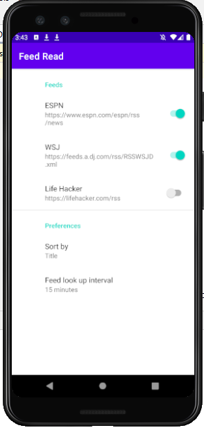

# News Reader
 An Android Appliction which can subscribe news and read news
## Tools
 Android studio, Bundle, ViewModel,Fragment, Background taks. Brpadcasts,

## Demo

## Reference:
https://developer.android.com/reference/org/xmlpull/v1/XmlPullParser

https://stackoverflow.com/questions/48341138/mysterious-exception-when-use-http-url-connection

https://stackoverflow.com/questions/45940861/android-8-cleartext-http-traffic-not-permitted

https://stackoverflow.com/questions/6343166/how-to-fix-android-os-networkonmainthreadexception

